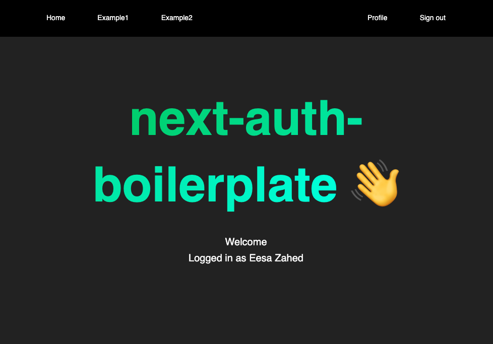

# next-auth-boilerplate

A boilerplate to save time on setting up:

- Next.js
- Tailwind
- Prisma
- Next-auth
- Sqlite

Clone it into your (empty) local directory

`git clone https://github.com/eesazahed/next-auth-boilerplate.git .`

then install the node modules 

`npm i`

initialize the prisma sqlite db with

`npx prisma db push`

setup [google auth credentials](https://console.cloud.google.com/projectcreate) and create a `.env` file based off the template in `.env.example`

then run it 

`npm run dev`

